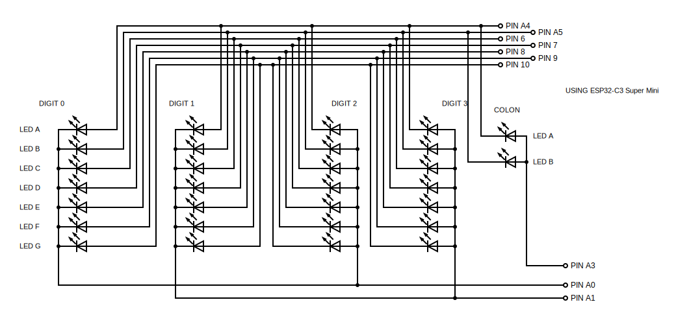
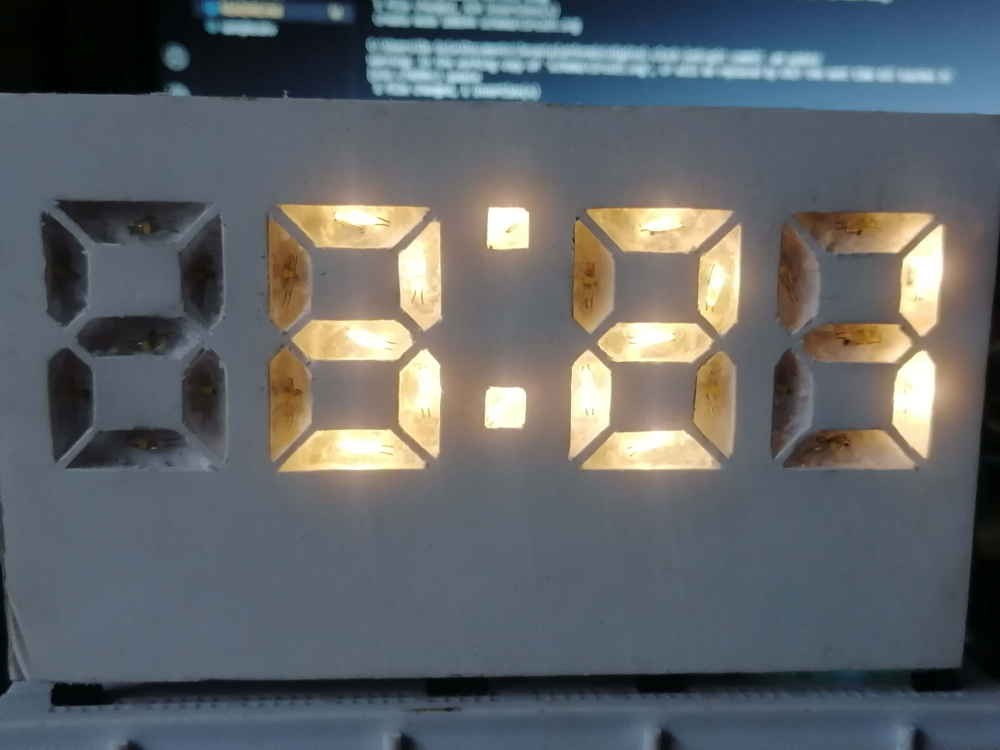

# Digital Clock with Leds

This project uses ESP32-C3 Super Mini and 30pcs low watt leds

It automatically update date/time using wifi 

> Note: This module uses WiFi `802.1 lb/g/n protocol, 2.4GhHz`. 
> There might be a chance to not be able to connect to your 
> Mobile phone wifi (portable hotspot) like what I have experience.

## Setup

If you are using different module, please, modify the `platformio.ini` file
based on your preference and keep the dependencies.

Also, update the `src/connect.cpp` based on required wifi/connection setup.

- Rename `sample.env` -> `.env`
- Open `.env` and place your wifi name and password

## Circuit

```
//  BBB
// A   C
// A   C
//  GGG
// F   D
// F   D
//  EEE
```



## Sample Image




Any questions?

Email: jovandeguia@gmail.com
